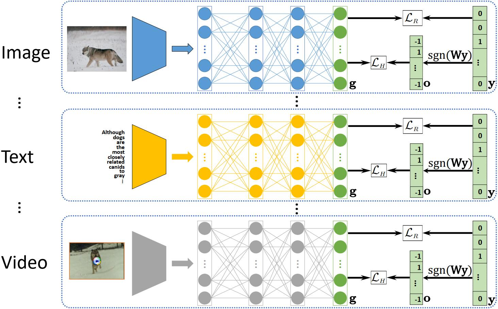
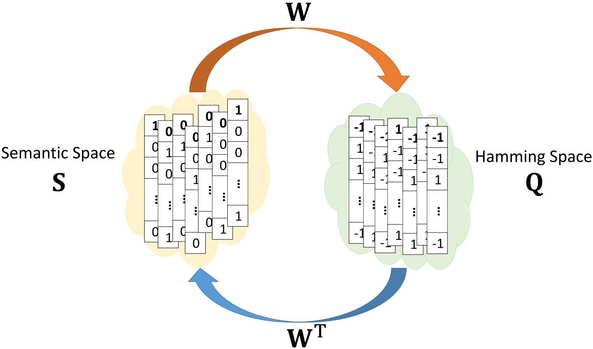

# 2021-IEEE TCYB-DCHN
Peng Hu, Xi Peng, Hongyuan Zhu, Jie Lin, Liangli Zhen, Dezhong Peng, [Joint Versus Independent Multiview Hashing for Cross-View Retrieval](http://doi.org/10.1109/TCYB.2020.3027614)[J]. IEEE Transactions on Cybernetics, vol. 51, no. 10, pp. 4982-4993, Oct. 2021. (PyTorch Code)

## Abstract
Thanks to the low storage cost and high query speed, cross-view hashing (CVH) has been successfully used for similarity search in multimedia retrieval. However, most existing CVH methods use all views to learn a common Hamming space, thus making it difficult to handle the data with increasing views or a large number of views. To overcome these difficulties, we propose a decoupled CVH network (DCHN) approach which consists of a semantic hashing autoencoder module (SHAM) and multiple multiview hashing networks (MHNs). To be specific, SHAM adopts a hashing encoder and decoder to learn a discriminative Hamming space using either a few labels or the number of classes, that is, the so-called flexible inputs. After that, MHN independently projects all samples into the discriminative Hamming space that is treated as an alternative ground truth. In brief, the Hamming space is learned from the semantic space induced from the flexible inputs, which is further used to guide view-specific hashing in an independent fashion. Thanks to such an independent/decoupled paradigm, our method could enjoy high computational efficiency and the capacity of handling the increasing number of views by only using a few labels or the number of classes. For a newly coming view, we only need to add a view-specific network into our model and avoid retraining the entire model using the new and previous views. Extensive experiments are carried out on five widely used multiview databases compared with 15 state-of-the-art approaches. The results show that the proposed independent hashing paradigm is superior to the common joint ones while enjoying high efficiency and the capacity of handling newly coming views.

## Framework

<h4>Figure 1. Framework of the proposed DCHN method. <font face="times" style="font-weight: bold;">g</font> is the output of the corresponding view (i.e., image, text, video, etc.). <b>o</b> is the semantic hash code that is computed by the corresponding label <b>y</b> and semantic hashing transformation <b>W</b>. <b>W</b> is computed by the proposed semantic hashing autoencoder module (SHAM). <font face="times" style="font-weight: bold;">sgn</font> is an elementwise sign function. &Lscr;<sub><i>R</i></sub> and &Lscr;<sub><i>H</i></sub> are hash reconstruction and semantic hashing functions, respectively. In the training stage, first, <b>W</b> is used to recast the label <b>y</b> as a ground-truth hash code <b>o</b>. Then, the obtained hash code is used to guide view-specific networks with a semantic hashing reconstruction regularizer. Such a learning scheme makes the v view-specific neural networks (one network for each view) can be trained separately since they are decoupled and do not share any trainable parameters. Therefore, our DCHN can be easy to scale to a large number of views. In the inference stage, each trained view-specific network f<sub>k</sub>(<b>x</b><sup>k</sup>, &Theta;<sub>k</sub>) is used to compute the hash code of the sample <b>x</b><sup>k</sup>.</h4>


<h4>Figure 1. Proposed SHAM utilizes the semantic information (<i>e.g.</i>, labels or classes) to learn an encoder <b>W</b> and a decoder <b>W</b><sup>T</sup> by mutually converting the semantic and Hamming spaces. SHAM is one key component of our independent hashing paradigm.</h4>


## Usage
First, to train SHAM wtih 64 bits on MIRFLICKR-25K, just run trainSHAM.py as follows:
```bash
python trainSHAM.py --datasets mirflickr25k --output_shape 64 --gama 1 --available_num 100
```

Then, to train a model for image modality wtih 64 bits on MIRFLICKR-25K, just run main_DCHN.py as follows:
```bash
python main_DCHN.py --mode train --epochs 100 --view 0 --datasets mirflickr25k --output_shape 64 --alpha 0.02 --gama 1 --available_num 100 --gpu_id 0
```
For text modality:
```bash
python main_DCHN.py --mode train --epochs 100 --view 1 --datasets mirflickr25k --output_shape 64 --alpha 0.02 --gama 1 --available_num 100 --gpu_id 1
```

To evaluate the trained models, you could run main_DCHN.py as follows:
```bash
python main_DCHN.py --mode eval --view -1 --datasets mirflickr25k --output_shape 64 --alpha 0.02 --gama 1 --available_num 100 --num_workers 0
```

## Comparison with the State-of-the-Art
<table>
<thead>
  <h4>Table 1: Performance comparison in terms of MAP scores on the MIRFLICKR-25K and IAPR TC-12 datasets. The highest MAP score is shown in <b>bold</b>.</h4>
  <tr>
    <th class="tg-0lax" rowspan="3">&nbsp;&nbsp;&nbsp;Method&nbsp;&nbsp;&nbsp;</th>
    <th class="tg-baqh" colspan="8">MIRFLICKR-25K</th>
    <th class="tg-baqh" colspan="8">IAPR TC-12</th>
  </tr>
  <tr>
    <th class="tg-baqh" colspan="4">Image → Text</th>
    <th class="tg-baqh" colspan="4">Text → Image</th>
    <th class="tg-baqh" colspan="4">Image → Text</th>
    <th class="tg-baqh" colspan="4">Text → Image</th>
  </tr>
  <tr>
    <th class="tg-0lax">16</th>
    <th class="tg-0lax">32</th>
    <th class="tg-0lax">64</th>
    <th class="tg-0lax">128</th>
    <th class="tg-0lax">16</th>
    <th class="tg-0lax">32</th>
    <th class="tg-0lax">64</th>
    <th class="tg-0lax">128</th>
    <th class="tg-0lax">16</th>
    <th class="tg-0lax">32</th>
    <th class="tg-0lax">64</th>
    <th class="tg-0lax">128</th>
    <th class="tg-0lax">16</th>
    <th class="tg-0lax">32</th>
    <th class="tg-0lax">64</th>
    <th class="tg-0lax">128</th>
  </tr>
</thead>
<tbody>
  <tr>
    <td class="tg-0lax">Baseline</td>
    <td class="tg-0lax">0.581</td>
    <td class="tg-0lax">0.520</td>
    <td class="tg-0lax">0.553</td>
    <td class="tg-0lax">0.573</td>
    <td class="tg-0lax">0.578</td>
    <td class="tg-0lax">0.544</td>
    <td class="tg-0lax">0.556</td>
    <td class="tg-0lax">0.579</td>
    <td class="tg-0lax">0.329</td>
    <td class="tg-0lax">0.292</td>
    <td class="tg-0lax">0.309</td>
    <td class="tg-0lax">0.298</td>
    <td class="tg-0lax">0.332</td>
    <td class="tg-0lax">0.295</td>
    <td class="tg-0lax">0.311</td>
    <td class="tg-0lax">0.304</td>
  </tr>
  <tr>
    <td class="tg-0lax">SePH [21]</td>
    <td class="tg-0lax">0.729</td>
    <td class="tg-0lax">0.738</td>
    <td class="tg-0lax">0.744</td>
    <td class="tg-0lax">0.750</td>
    <td class="tg-0lax">0.753</td>
    <td class="tg-0lax">0.762</td>
    <td class="tg-0lax">0.764</td>
    <td class="tg-0lax">0.769</td>
    <td class="tg-0lax">0.467</td>
    <td class="tg-0lax">0.476</td>
    <td class="tg-0lax">0.486</td>
    <td class="tg-0lax">0.493</td>
    <td class="tg-0lax">0.463</td>
    <td class="tg-0lax">0.475</td>
    <td class="tg-0lax">0.485</td>
    <td class="tg-0lax">0.492</td>
  </tr>
  <tr>
    <td class="tg-0lax">SePH<sub>lr</sub> [12]</td>
    <td class="tg-0lax">0.729</td>
    <td class="tg-0lax">0.746</td>
    <td class="tg-0lax">0.754</td>
    <td class="tg-0lax">0.763</td>
    <td class="tg-0lax">0.760</td>
    <td class="tg-0lax">0.780</td>
    <td class="tg-0lax">0.785</td>
    <td class="tg-0lax">0.793</td>
    <td class="tg-0lax">0.410</td>
    <td class="tg-0lax">0.434</td>
    <td class="tg-0lax">0.448</td>
    <td class="tg-0lax">0.463</td>
    <td class="tg-0lax">0.461</td>
    <td class="tg-0lax">0.495</td>
    <td class="tg-0lax">0.515</td>
    <td class="tg-0lax">0.525</td>
  </tr>
  <tr>
    <td class="tg-0lax">RoPH [34]</td>
    <td class="tg-0lax">0.733</td>
    <td class="tg-0lax">0.744</td>
    <td class="tg-0lax">0.749</td>
    <td class="tg-0lax">0.756</td>
    <td class="tg-0lax">0.757</td>
    <td class="tg-0lax">0.759</td>
    <td class="tg-0lax">0.768</td>
    <td class="tg-0lax">0.771</td>
    <td class="tg-0lax">0.457</td>
    <td class="tg-0lax">0.481</td>
    <td class="tg-0lax">0.493</td>
    <td class="tg-0lax">0.500</td>
    <td class="tg-0lax">0.451</td>
    <td class="tg-0lax">0.478</td>
    <td class="tg-0lax">0.488</td>
    <td class="tg-0lax">0.495</td>
  </tr>
  <tr>
    <td class="tg-0lax">LSRH [22]</td>
    <td class="tg-0lax">0.756</td>
    <td class="tg-0lax">0.780</td>
    <td class="tg-0lax">0.788</td>
    <td class="tg-0lax">0.800</td>
    <td class="tg-0lax">0.772</td>
    <td class="tg-0lax">0.786</td>
    <td class="tg-0lax">0.791</td>
    <td class="tg-0lax">0.802</td>
    <td class="tg-0lax">0.474</td>
    <td class="tg-0lax">0.490</td>
    <td class="tg-0lax">0.512</td>
    <td class="tg-0lax">0.522</td>
    <td class="tg-0lax">0.474</td>
    <td class="tg-0lax">0.492</td>
    <td class="tg-0lax">0.511</td>
    <td class="tg-0lax">0.526</td>
  </tr>
  <tr>
    <td class="tg-0lax">KDLFH [23]</td>
    <td class="tg-0lax">0.734</td>
    <td class="tg-0lax">0.755</td>
    <td class="tg-0lax">0.770</td>
    <td class="tg-0lax">0.771</td>
    <td class="tg-0lax">0.764</td>
    <td class="tg-0lax">0.780</td>
    <td class="tg-0lax">0.794</td>
    <td class="tg-0lax">0.797</td>
    <td class="tg-0lax">0.306</td>
    <td class="tg-0lax">0.314</td>
    <td class="tg-0lax">0.351</td>
    <td class="tg-0lax">0.357</td>
    <td class="tg-0lax">0.307</td>
    <td class="tg-0lax">0.315</td>
    <td class="tg-0lax">0.350</td>
    <td class="tg-0lax">0.356</td>
  </tr>
  <tr>
    <td class="tg-0lax">DLFH [23]</td>
    <td class="tg-0lax">0.721</td>
    <td class="tg-0lax">0.743</td>
    <td class="tg-0lax">0.760</td>
    <td class="tg-0lax">0.767</td>
    <td class="tg-0lax">0.761</td>
    <td class="tg-0lax">0.788</td>
    <td class="tg-0lax">0.805</td>
    <td class="tg-0lax">0.810</td>
    <td class="tg-0lax">0.306</td>
    <td class="tg-0lax">0.314</td>
    <td class="tg-0lax">0.326</td>
    <td class="tg-0lax">0.340</td>
    <td class="tg-0lax">0.305</td>
    <td class="tg-0lax">0.315</td>
    <td class="tg-0lax">0.333</td>
    <td class="tg-0lax">0.353</td>
  </tr>
  <tr>
    <td class="tg-0lax">MTFH [13]</td>
    <td class="tg-0lax">0.581</td>
    <td class="tg-0lax">0.571</td>
    <td class="tg-0lax">0.645</td>
    <td class="tg-0lax">0.543</td>
    <td class="tg-0lax">0.584</td>
    <td class="tg-0lax">0.556</td>
    <td class="tg-0lax">0.633</td>
    <td class="tg-0lax">0.531</td>
    <td class="tg-0lax">0.303</td>
    <td class="tg-0lax">0.303</td>
    <td class="tg-0lax">0.307</td>
    <td class="tg-0lax">0.300</td>
    <td class="tg-0lax">0.303</td>
    <td class="tg-0lax">0.303</td>
    <td class="tg-0lax">0.308</td>
    <td class="tg-0lax">0.302</td>
  </tr>
  <tr>
    <td class="tg-0lax">DJSRH [14]</td>
    <td class="tg-0lax">0.620</td>
    <td class="tg-0lax">0.630</td>
    <td class="tg-0lax">0.645</td>
    <td class="tg-0lax">0.660</td>
    <td class="tg-0lax">0.620</td>
    <td class="tg-0lax">0.626</td>
    <td class="tg-0lax">0.645</td>
    <td class="tg-0lax">0.649</td>
    <td class="tg-0lax">0.368</td>
    <td class="tg-0lax">0.396</td>
    <td class="tg-0lax">0.419</td>
    <td class="tg-0lax">0.439</td>
    <td class="tg-0lax">0.370</td>
    <td class="tg-0lax">0.400</td>
    <td class="tg-0lax">0.423</td>
    <td class="tg-0lax">0.437</td>
  </tr>
  <tr>
    <td class="tg-0lax">DCMH [9]</td>
    <td class="tg-0lax">0.737</td>
    <td class="tg-0lax">0.754</td>
    <td class="tg-0lax">0.763</td>
    <td class="tg-0lax">0.771</td>
    <td class="tg-0lax">0.753</td>
    <td class="tg-0lax">0.760</td>
    <td class="tg-0lax">0.763</td>
    <td class="tg-0lax">0.770</td>
    <td class="tg-0lax">0.423</td>
    <td class="tg-0lax">0.439</td>
    <td class="tg-0lax">0.456</td>
    <td class="tg-0lax">0.463</td>
    <td class="tg-0lax">0.449</td>
    <td class="tg-0lax">0.464</td>
    <td class="tg-0lax">0.476</td>
    <td class="tg-0lax">0.481</td>
  </tr>
  <tr>
    <td class="tg-0lax">SSAH [20]</td>
    <td class="tg-0lax">0.797</td>
    <td class="tg-0lax">0.809</td>
    <td class="tg-0lax">0.810</td>
    <td class="tg-0lax">0.802</td>
    <td class="tg-0lax">0.782</td>
    <td class="tg-0lax">0.797</td>
    <td class="tg-0lax">0.799</td>
    <td class="tg-0lax">0.790</td>
    <td class="tg-0lax">0.501</td>
    <td class="tg-0lax">0.503</td>
    <td class="tg-0lax">0.496</td>
    <td class="tg-0lax">0.479</td>
    <td class="tg-0lax">0.504</td>
    <td class="tg-0lax">0.530</td>
    <td class="tg-0lax">0.554</td>
    <td class="tg-0lax">0.565</td>
  </tr>
  <tr>
    <td class="tg-0lax">DCHN<sub>0</sub></td>
    <td class="tg-1wig"><b>0.806</b></td>
    <td class="tg-1wig"><b>0.823</td>
    <td class="tg-1wig"><b>0.836</td>
    <td class="tg-1wig"><b>0.842</td>
    <td class="tg-1wig"><b>0.797</td>
    <td class="tg-1wig"><b>0.808</td>
    <td class="tg-1wig"><b>0.823</td>
    <td class="tg-1wig"><b>0.827</td>
    <td class="tg-0lax">0.487</td>
    <td class="tg-0lax">0.492</td>
    <td class="tg-0lax"><b>0.550</td>
    <td class="tg-1wig"><b>0.573</td>
    <td class="tg-1wig">0.481</td>
    <td class="tg-0lax">0.488</td>
    <td class="tg-0lax">0.543</td>
    <td class="tg-1wig"><b>0.567</td>
  </tr>
  <tr>
    <td class="tg-0lax">DCHN<sub>100</sub></td>
    <td class="tg-1wig"><b>0.813</td>
    <td class="tg-1wig"><b>0.816</td>
    <td class="tg-1wig"><b>0.823</td>
    <td class="tg-1wig"><b>0.840</td>
    <td class="tg-1wig"><b>0.808</td>
    <td class="tg-1wig"><b>0.803</td>
    <td class="tg-1wig"><b>0.814</td>
    <td class="tg-1wig"><b>0.830</td>
    <td class="tg-1wig"><b>0.533</td>
    <td class="tg-1wig"><b>0.558</td>
    <td class="tg-1wig"><b>0.582</td>
    <td class="tg-1wig"><b>0.596</td>
    <td class="tg-1wig"><b>0.527</td>
    <td class="tg-1wig"><b>0.557</td>
    <td class="tg-1wig"><b>0.582</td>
    <td class="tg-1wig"><b>0.595</td>
  </tr>
</tbody>
</table>


<table>
<thead>
  <h4>Table 2: Performance comparison in terms of MAP scores on the NUS-WIDE and MS-COCO datasets. The highest MAP score is shown in <b>bold</b>.</h4>
  <tr>
    <th class="tg-0pky" rowspan="3">&nbsp;&nbsp;&nbsp;Method&nbsp;&nbsp;&nbsp;</th>
    <th class="tg-c3ow" colspan="8">NUS-WIDE</th>
    <th class="tg-c3ow" colspan="8">MS-COCO</th>
  </tr>
  <tr>
    <th class="tg-c3ow" colspan="4">Image → Text</th>
    <th class="tg-c3ow" colspan="4">Text → Image</th>
    <th class="tg-c3ow" colspan="4">Image → Text</th>
    <th class="tg-c3ow" colspan="4">Text → Image</th>
  </tr>
  <tr>
    <th class="tg-0pky">16</th>
    <th class="tg-0pky">32</th>
    <th class="tg-0pky">64</th>
    <th class="tg-0pky">128</th>
    <th class="tg-0pky">16</th>
    <th class="tg-0pky">32</th>
    <th class="tg-0pky">64</th>
    <th class="tg-0pky">128</th>
    <th class="tg-0pky">16</th>
    <th class="tg-0pky">32</th>
    <th class="tg-0pky">64</th>
    <th class="tg-0pky">128</th>
    <th class="tg-0pky">16</th>
    <th class="tg-0pky">32</th>
    <th class="tg-0pky">64</th>
    <th class="tg-0pky">128</th>
  </tr>
</thead>
<tbody>
  <tr>
    <td class="tg-0pky">Baseline</td>
    <td class="tg-0pky">0.281</td>
    <td class="tg-0pky">0.337</td>
    <td class="tg-0pky">0.263</td>
    <td class="tg-0pky">0.341</td>
    <td class="tg-0pky">0.299</td>
    <td class="tg-0pky">0.339</td>
    <td class="tg-0pky">0.276</td>
    <td class="tg-0pky">0.346</td>
    <td class="tg-0pky">0.362</td>
    <td class="tg-0pky">0.336</td>
    <td class="tg-0pky">0.332</td>
    <td class="tg-0pky">0.373</td>
    <td class="tg-0pky">0.348</td>
    <td class="tg-0pky">0.341</td>
    <td class="tg-0pky">0.347</td>
    <td class="tg-0pky">0.359</td>
  </tr>
  <tr>
    <td class="tg-0pky">SePH [21]</td>
    <td class="tg-0pky">0.644</td>
    <td class="tg-0pky">0.652</td>
    <td class="tg-0pky">0.661</td>
    <td class="tg-0pky">0.664</td>
    <td class="tg-0pky">0.654</td>
    <td class="tg-0pky">0.662</td>
    <td class="tg-0pky">0.670</td>
    <td class="tg-0pky">0.673</td>
    <td class="tg-0pky">0.586</td>
    <td class="tg-0pky">0.598</td>
    <td class="tg-0pky">0.620</td>
    <td class="tg-0pky">0.628</td>
    <td class="tg-0pky">0.587</td>
    <td class="tg-0pky">0.594</td>
    <td class="tg-0pky">0.618</td>
    <td class="tg-0pky">0.625</td>
  </tr>
  <tr>
    <td class="tg-0pky">SePHlr [12]</td>
    <td class="tg-0pky">0.607</td>
    <td class="tg-0pky">0.624</td>
    <td class="tg-0pky">0.644</td>
    <td class="tg-0pky">0.651</td>
    <td class="tg-0pky">0.630</td>
    <td class="tg-0pky">0.649</td>
    <td class="tg-0pky">0.665</td>
    <td class="tg-0pky">0.672</td>
    <td class="tg-0pky">0.527</td>
    <td class="tg-0pky">0.571</td>
    <td class="tg-0pky">0.592</td>
    <td class="tg-0pky">0.600</td>
    <td class="tg-0pky">0.555</td>
    <td class="tg-0pky">0.596</td>
    <td class="tg-0pky">0.618</td>
    <td class="tg-0pky">0.621</td>
  </tr>
  <tr>
    <td class="tg-0pky">RoPH [34]</td>
    <td class="tg-0pky">0.638</td>
    <td class="tg-0pky">0.656</td>
    <td class="tg-0pky">0.662</td>
    <td class="tg-0pky">0.669</td>
    <td class="tg-0pky">0.645</td>
    <td class="tg-0pky">0.665</td>
    <td class="tg-0pky">0.671</td>
    <td class="tg-0pky">0.677</td>
    <td class="tg-0pky">0.592</td>
    <td class="tg-0pky">0.634</td>
    <td class="tg-0pky">0.649</td>
    <td class="tg-0pky">0.657</td>
    <td class="tg-0pky">0.587</td>
    <td class="tg-0pky">0.628</td>
    <td class="tg-0pky">0.643</td>
    <td class="tg-0pky">0.652</td>
  </tr>
  <tr>
    <td class="tg-0pky">LSRH [22]</td>
    <td class="tg-0pky">0.622</td>
    <td class="tg-0pky">0.650</td>
    <td class="tg-0pky">0.659</td>
    <td class="tg-0pky">0.690</td>
    <td class="tg-0pky">0.600</td>
    <td class="tg-0pky">0.662</td>
    <td class="tg-0pky">0.685</td>
    <td class="tg-0pky">0.692</td>
    <td class="tg-0pky">0.580</td>
    <td class="tg-0pky">0.563</td>
    <td class="tg-0pky">0.561</td>
    <td class="tg-0pky">0.567</td>
    <td class="tg-0pky">0.580</td>
    <td class="tg-0pky">0.611</td>
    <td class="tg-0pky">0.615</td>
    <td class="tg-0pky">0.632</td>
  </tr>
  <tr>
    <td class="tg-0pky">KDLFH [23]</td>
    <td class="tg-0pky">0.323</td>
    <td class="tg-0pky">0.367</td>
    <td class="tg-0pky">0.364</td>
    <td class="tg-0pky">0.403</td>
    <td class="tg-0pky">0.325</td>
    <td class="tg-0pky">0.365</td>
    <td class="tg-0pky">0.368</td>
    <td class="tg-0pky">0.408</td>
    <td class="tg-0pky">0.373</td>
    <td class="tg-0pky">0.403</td>
    <td class="tg-0pky">0.451</td>
    <td class="tg-0pky">0.542</td>
    <td class="tg-0pky">0.370</td>
    <td class="tg-0pky">0.400</td>
    <td class="tg-0pky">0.449</td>
    <td class="tg-0pky">0.542</td>
  </tr>
  <tr>
    <td class="tg-0pky">DLFH [23]</td>
    <td class="tg-0pky">0.316</td>
    <td class="tg-0pky">0.367</td>
    <td class="tg-0pky">0.381</td>
    <td class="tg-0pky">0.404</td>
    <td class="tg-0pky">0.319</td>
    <td class="tg-0pky">0.379</td>
    <td class="tg-0pky">0.386</td>
    <td class="tg-0pky">0.415</td>
    <td class="tg-0pky">0.352</td>
    <td class="tg-0pky">0.398</td>
    <td class="tg-0pky">0.455</td>
    <td class="tg-0pky">0.443</td>
    <td class="tg-0pky">0.359</td>
    <td class="tg-0pky">0.393</td>
    <td class="tg-0pky">0.456</td>
    <td class="tg-0pky">0.442</td>
  </tr>
  <tr>
    <td class="tg-0pky">MTFH [13]</td>
    <td class="tg-0pky">0.265</td>
    <td class="tg-0pky">0.473</td>
    <td class="tg-0pky">0.434</td>
    <td class="tg-0pky">0.445</td>
    <td class="tg-0pky">0.243</td>
    <td class="tg-0pky">0.418</td>
    <td class="tg-0pky">0.414</td>
    <td class="tg-0pky">0.485</td>
    <td class="tg-0pky">0.288</td>
    <td class="tg-0pky">0.264</td>
    <td class="tg-0pky">0.311</td>
    <td class="tg-0pky">0.413</td>
    <td class="tg-0pky">0.301</td>
    <td class="tg-0pky">0.284</td>
    <td class="tg-0pky">0.310</td>
    <td class="tg-0pky">0.406</td>
  </tr>
  <tr>
    <td class="tg-0pky">DJSRH [14]</td>
    <td class="tg-0pky">0.433</td>
    <td class="tg-0pky">0.453</td>
    <td class="tg-0pky">0.467</td>
    <td class="tg-0pky">0.442</td>
    <td class="tg-0pky">0.457</td>
    <td class="tg-0pky">0.468</td>
    <td class="tg-0pky">0.468</td>
    <td class="tg-0pky">0.501</td>
    <td class="tg-0pky">0.478</td>
    <td class="tg-0pky">0.520</td>
    <td class="tg-0pky">0.544</td>
    <td class="tg-0pky">0.566</td>
    <td class="tg-0pky">0.462</td>
    <td class="tg-0pky">0.525</td>
    <td class="tg-0pky">0.550</td>
    <td class="tg-0pky">0.567</td>
  </tr>
  <tr>
    <td class="tg-0pky">DCMH [9]</td>
    <td class="tg-0pky">0.569</td>
    <td class="tg-0pky">0.595</td>
    <td class="tg-0pky">0.612</td>
    <td class="tg-0pky">0.621</td>
    <td class="tg-0pky">0.548</td>
    <td class="tg-0pky">0.573</td>
    <td class="tg-0pky">0.585</td>
    <td class="tg-0pky">0.592</td>
    <td class="tg-0pky">0.548</td>
    <td class="tg-0pky">0.575</td>
    <td class="tg-0pky">0.607</td>
    <td class="tg-0pky">0.625</td>
    <td class="tg-0pky">0.568</td>
    <td class="tg-0pky">0.595</td>
    <td class="tg-0pky">0.643</td>
    <td class="tg-0pky">0.664</td>
  </tr>
  <tr>
    <td class="tg-0pky">SSAH [20]</td>
    <td class="tg-0pky">0.636</td>
    <td class="tg-0pky">0.636</td>
    <td class="tg-0pky">0.637</td>
    <td class="tg-0pky">0.510</td>
    <td class="tg-0pky">0.653</td>
    <td class="tg-0pky">0.676</td>
    <td class="tg-0pky">0.683</td>
    <td class="tg-0pky">0.682</td>
    <td class="tg-0pky">0.550</td>
    <td class="tg-0pky">0.577</td>
    <td class="tg-0pky">0.576</td>
    <td class="tg-0pky">0.581</td>
    <td class="tg-0pky">0.552</td>
    <td class="tg-0pky">0.578</td>
    <td class="tg-0pky">0.578</td>
    <td class="tg-0pky">0.669</td>
  </tr>
  <tr>
    <td class="tg-0pky">DCHN<sub>0</sub></td>
    <td class="tg-fymr"><b>0.648</b></td>
    <td class="tg-fymr"><b>0.660</b></td>
    <td class="tg-fymr"><b>0.669</b></td>
    <td class="tg-fymr">0.683</td>
    <td class="tg-fymr"><b>0.662</b></td>
    <td class="tg-fymr"><b>0.677</b></td>
    <td class="tg-fymr"><b>0.685</b></td>
    <td class="tg-fymr"><b>0.697</b></td>
    <td class="tg-fymr"><b>0.602</b></td>
    <td class="tg-fymr"><b>0.658</b></td>
    <td class="tg-fymr"><b>0.682</b></td>
    <td class="tg-fymr"><b>0.706</b></td>
    <td class="tg-fymr"><b>0.591</b></td>
    <td class="tg-fymr"><b>0.652</b></td>
    <td class="tg-fymr"><b>0.669</b></td>
    <td class="tg-fymr"><b>0.696</b></td>
  </tr>
  <tr>
    <td class="tg-0pky">DCHN<sub>100</sub></td>
    <td class="tg-fymr"><b>0.654</b></td>
    <td class="tg-fymr"><b>0.671</b></td>
    <td class="tg-fymr"><b>0.681</b></td>
    <td class="tg-fymr"><b>0.691</b></td>
    <td class="tg-fymr"><b>0.668</b></td>
    <td class="tg-fymr"><b>0.683</b></td>
    <td class="tg-fymr"><b>0.697</b></td>
    <td class="tg-fymr"><b>0.707</b></td>
    <td class="tg-fymr"><b>0.662</b></b></td>
    <td class="tg-fymr"><b>0.701</b></td>
    <td class="tg-fymr"><b>0.703</b></td>
    <td class="tg-fymr"><b>0.720</b></td>
    <td class="tg-fymr"><b>0.650</b></td>
    <td class="tg-fymr"><b>0.689</b></td>
    <td class="tg-fymr"><b>0.693</b></td>
    <td class="tg-fymr"><b>0.714</b></td>
  </tr>
</tbody>
</table>

## Citation
If you find DCHN useful in your research, please consider citing:
```
@article{hu2021joint,
  author={Hu, Peng and Peng, Xi and Zhu, Hongyuan and Lin, Jie and Zhen, Liangli and Peng, Dezhong},
  journal={IEEE Transactions on Cybernetics}, 
  title={Joint Versus Independent Multiview Hashing for Cross-View Retrieval}, 
  year={2021},
  volume={51},
  number={10},
  pages={4982-4993},
  doi={10.1109/TCYB.2020.3027614}}
}
```
